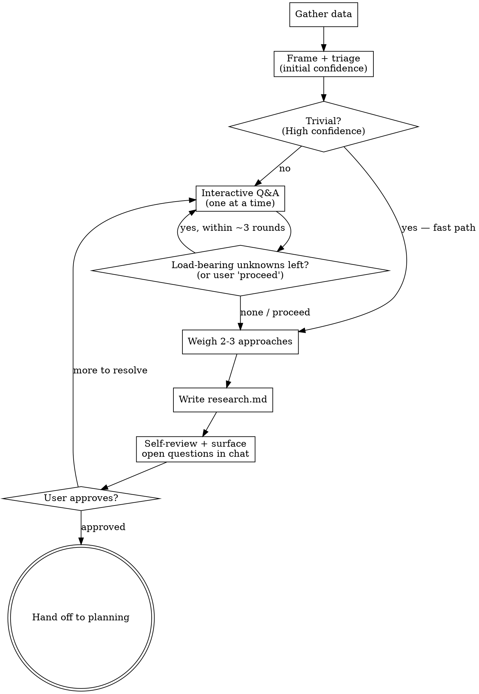

# Phase 1 — Research

Turn a fuzzy request into a grounded, decided-upon direction through **data gathering +
interactive dialogue**, and record it so planning has everything it needs.

Research is the headline phase. Do not rush it, and do not let it slide into writing a plan or
code — its only output is `research.md`.

**Announce at start:** "Using planning — Phase 1: Research. Investigating this before we plan."

<HARD-GATE>
Do NOT write a plan, create task files, scaffold, or write implementation code during this
phase. The only file this phase writes is `plans/plan-<plan-name>/research.md`. The terminal
action is handing off to Phase 2 (Planning) — and only after the user approves the research.
</HARD-GATE>

## Checklist

Create a todo per item and complete them in order:

1. **Gather data** — read the codebase, docs, and recent commits relevant to the request.
   Follow existing patterns; note extension points, constraints, and prior art. Pull in
   external references only if the task genuinely needs them.
2. **Frame the goal + triage** — state, in one paragraph, what success looks like, and confirm
   it with the user. Then form an **initial Confidence Score** (see Confidence below). This is
   the triage: a trivial, well-understood task starts near-High and takes the **fast path**
   (skip the Q&A — go straight to a short direction and, on approval, hand to planning);
   anything less runs the full loop.
3. **Interactive Q&A (confidence-driven)** — ask clarifying questions **one at a time**,
   surfacing current assumptions first and updating confidence after each answer. Keep asking
   only while **load-bearing unknowns** remain; stop when none do or the user says *proceed*.
   Honor the escape-hatch and the soft cap (see Confidence).
4. **Weigh approaches** — propose 2-3 concrete approaches with trade-offs (shape / where it
   lives / strengths / weaknesses / cost / reversibility). Lead with a recommendation and say
   why. YAGNI ruthlessly.
5. **Finalize confidence + surface assumptions** — record the final Confidence Score, and
   **always list your load-bearing assumptions in chat — even at High** — so the user can catch
   an overconfident read before anything is written.
6. **Write `research.md`** — save to `plans/plan-<plan-name>/research.md` using the template in
   `templates.md`. Give each settled requirement/constraint a stable `REQ-NNN` id; record
   unconfirmed assumptions (§8) and unresolved questions (§7) explicitly.
7. **Self-review** — scan for placeholders, contradictions, unresolved questions, and scope
   creep. Fix inline.
8. **Surface open questions as blockers** — if any question is still unresolved, state it **in
   chat** (not only in §7) and name **what it blocks** (a specific `REQ`, an approach, or
   "planning as a whole"). A blocker must never hide inside the doc.
9. **User approval gate** — ask the user to review `research.md`. Only on approval, offer the
   handoff to Phase 2.

## Confidence: the running convergence gauge

Confidence is **not** a number you compute once at the end — it is a **live gauge** that governs
how much you ask, and later how planning commits. Estimate it initially (step 2), update it
after every answer (step 3), record the final value (step 5).

**Four drivers** (judge qualitatively — no weighted formula):

- **Clarity of requirements** — is the desired outcome unambiguous?
- **Known complexity** — do you understand the shape and size of the work?
- **Sufficiency of data** — did the codebase/docs answer the load-bearing questions?
- **Consistency of answers** — do the user's answers agree, or contradict / drift in vocabulary?
  Contradiction **lowers** confidence and is a signal to re-align terms before continuing.

**Bands → how you question:**

| Confidence | Behavior |
|---|---|
| **High (>85%)** | Fast path: skip Q&A or ask at most one confirming question; list load-bearing assumptions and let the user correct them. |
| **Medium (66-85%)** | Ask only targeted questions on load-bearing unknowns; converge. |
| **Low (<66%)** | Explore more broadly; if it won't rise after reasonable effort, narrow scope or say the task isn't ready to plan. |

**Problem-domain lens (Cynefin):** confidence measures how *ready* you are; classifying the work
by cause-effect says which *path* fits — use it to ground the triage, not as a second framework.

- **Clear** (obvious, known runbook) → fast path.
- **Complicated** (expert-analyzable, one right design) → full plan.
- **Complex** (unknowns only resolve by trying) → PoC-first / safe-to-fail probe.
- **Chaotic** (no stable ground) → don't plan; narrow scope or stabilize first.

**Stop rule (primary):** stop asking when **no load-bearing unknown remains** — no unresolved
decision that would change the plan — or when the user says *proceed*. The percentage is a label
for the band, not a precise gate.

**Soft cap (safety net):** if unknowns are not converging after **~3 rounds**, do not grind on —
make an explicit decision:

- **proceed on assumptions** — record them in §8 and surface them in chat as blockers (step 8), or
- **declare the task not ready** — narrow scope or return to data-gathering.

**Escape-hatch:** in every round, offer the exit — *"answer all, answer selectively, or say
**proceed** and I'll continue on my stated assumptions."* A *proceed* jumps to writing, with
unconfirmed assumptions recorded and flagged.

**Final confidence drives planning** (surface it in the handoff): High → full plan; Medium →
PoC-first slice; Low → don't plan, keep researching.

## Process flow



## Rules

- **One question per message.** If a topic needs more exploration, break it into several
  questions across turns. Never batch a questionnaire.
- **Verify before you name.** Every file path, module, or function you cite must be confirmed
  with a tool call — no guessing from memory.
- **Gather before you ask.** Do the data-gathering pass first so your questions are informed,
  not generic.
- **Scope signal.** If the request bundles multiple independent subsystems, say so and help
  decompose into sub-projects — each sub-project gets its own `plan-<name>/` folder with its own
  research → plan → tasks cycle. Don't spend questions refining a project that needs splitting
  first.
- **Propose solutions with findings.** When you surface a problem or gap, always propose at
  least one concrete path in the same message — never just identify it and stop.
- **Express uncertainty** honestly. If you don't know, say so and gather more data rather than
  filling the gap with an assumption.

## The `plan-<plan-name>` folder

Pick a short kebab-case `<plan-name>` from the request (e.g. `oauth-login`, `cache-refactor`).
All artifacts for this effort live under:

```
plans/plan-<plan-name>/
    research.md          # this phase writes it
    plan.md              # Phase 2 writes it later
    tasks/               # Phase 2 writes these later
```

Create the folder when you write `research.md`. If a `plans/plan-<plan-name>/` already exists,
confirm with the user whether to continue that effort or start a new one.

## Handoff

After the user approves `research.md`:

> "Research approved and saved to `plans/plan-<plan-name>/research.md` (Confidence: N%). Ready
> to build the Roadmap and tasks — shall I move to the planning phase?"

State the Confidence Score in the handoff so planning picks the right strategy (full plan /
PoC-first / more research). On yes, read `planning.md` and proceed.
